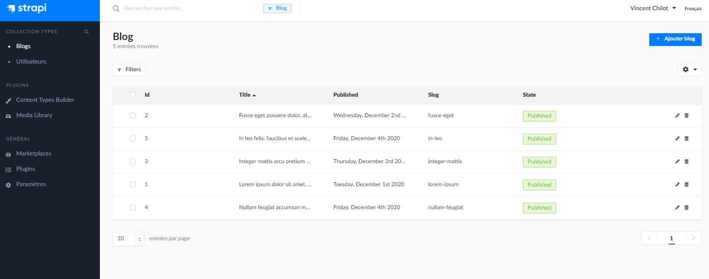
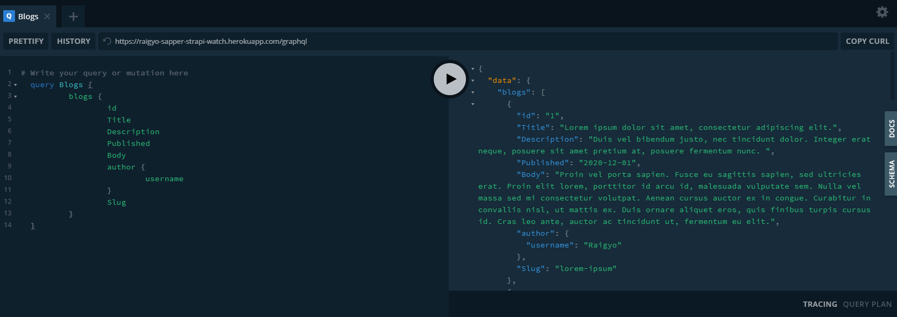
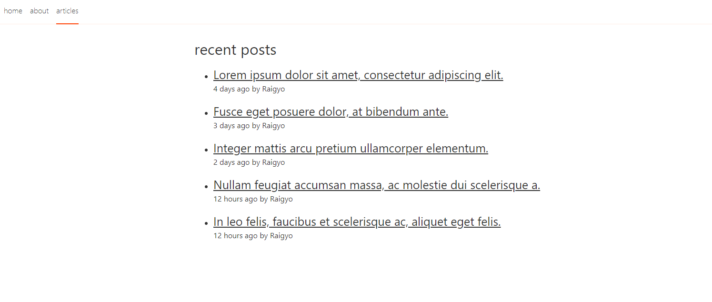

# Svelte.js - Creating A Static Blog With Sapper And Strapi

December 2020

> 🔨  Creating A Static Blog With Sapper And Strapi.
>
> From [smashing Magazine](https://www.smashingmagazine.com/2020/08/static-blog-sapper-strapi/)

* * *

Front End on [Netlify](https://friendly-beaver-b2c0b1.netlify.app/)

Backend on [Heroku](https://raigyo-sapper-strapi-watch.herokuapp.com/)







**Svelte** is a radical new approach to building user interfaces. Whereas traditional frameworks
like React and Vue do the bulk of their work in the browser, Svelte shifts that work into a compile
step that happens when you build your app.

Instead of using techniques like virtual DOM diffing, Svelte writes code that surgically updates
the DOM when the state of your app changes.

**Sapper / Svelte app maker** is a framework - powered by Svelte - for building web applications
of all sizes, with a beautiful development experience and flexible filesystem-based routing.

Unlike single-page apps, Sapper doesn't compromise on SEO, progressive enhancement or the initial
load experience — but unlike traditional server-rendered apps, navigation is instantaneous for
that app-like feel.

**Apollo Client** is a comprehensive state management library for JavaScript that enables you to
manage both local and remote data with GraphQL. Use it to fetch, cache, and modify application
data, all while automatically updating your UI.

**Strapi** is an open-source, Node.js based, headless CMS to manage content and make it available
through a fully customizable API. It is designed to build practical, production-ready Node.js APIs
in hours instead of weeks.

## Sapper Front End

````bash
npx degit "sveltejs/sapper-template#rollup" frontend
# or: npx degit "sveltejs/sapper-template#webpack" frontend
cd frontend
npm install
npm run dev
````

[http://localhost:3000/](http://localhost:3000/)

### Sapper app structure

├ package.json
├ src
│ ├ routes
│ │ ├ # your routes here
│ │ ├ _error.svelte
│ │ └ index.svelte
│ ├ client.js
│ ├ server.js
│ ├ service-worker.js
│ └ template.html
├ static
│ ├ # your files here
└ rollup.config.js / webpack.config.js

## Strapi Back End

````bash
yarn create strapi-app backend --quickstart

cd backend

# We can use JSON but also GraphQL

yarn strapi install graphql
````

- [Strapi Admin](http://localhost:1337/admin)
- [GraphQL playground](http://localhost:1337/graphql)
- [JSON data](http://localhost:1337/Blogs) - use name of the collection

Note about Roles and permissions: moved into the Settings menu.

In /admin/settings/users-permissions/roles then to "Public" role and in the "Application" permission
section check count, findone and find, it will cover needs of an API for frontend app.

### Heroku and GraphQL

 Create settings.json file in above path ./extensions/graphql/config/settings.json

{
  "endpoint": "/graphql",
  "tracing": false,
  "shadowCRUD": true,
  "playgroundAlways": true,
  "depthLimit": 7,
  "amountLimit": 100
}

## Piecing Together Both Ends

Because we are using the Strapi GraphQL, we will have to install the Svelte Apollo client and a few other packages to make sure everything works properly.

In *front end* part:

````bash
npm i --save apollo-boost graphql svelte-apollo moment
````

## Export a static version of the Front application

````bash
npm run export
````


## Useful links

- [Creating A Static Blog With Sapper And Strapi](https://www.smashingmagazine.com/2020/08/static-blog-sapper-strapi/)
- [Svelte](https://svelte.dev/)
- [Sapper](https://sapper.svelte.dev/)
- [Apollo](https://www.apollographql.com/)
- [Strapi](https://strapi.io/)